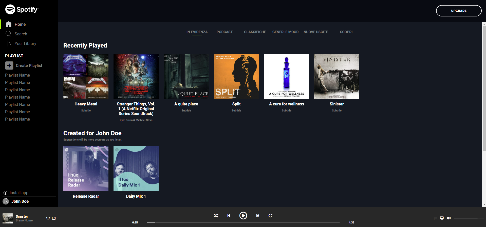
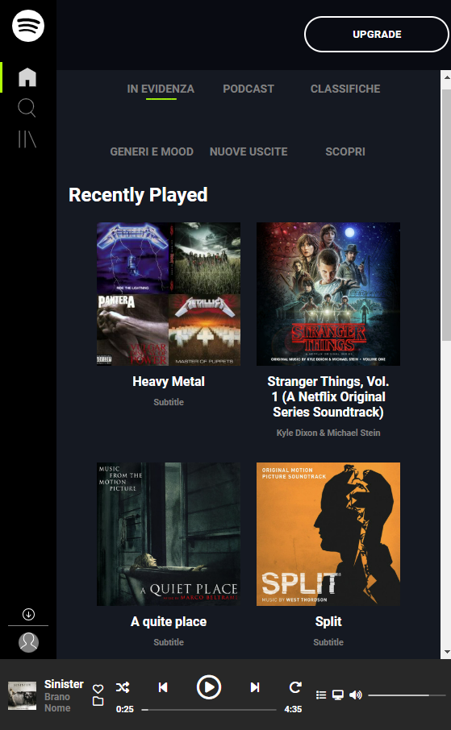

# Spotify Web Interface Clone

A pixel-perfect recreation of Spotify's web interface using only HTML and CSS. This project showcases responsive design and CSS Grid/Flexbox mastery without any external libraries.

## Key Features

- Responsive layout that adapts from mobile to desktop
- Interactive hover states and animations using pure CSS
- Identical UI components matching Spotify's design
- Custom audio player controls
- Grid-based album layouts
- Side navigation with collapsible menu

## Screenshots

### Desktop View

### Mobile View

## Preview

Clone and open `index.html` to see the interface in action.

## Technologies

- Pure HTML5
- Vanilla CSS3 with:
  - CSS Grid
  - Flexbox
  - Media Queries
  - Custom Properties
  - Animations

## Credits

Design inspiration from [Spotify](https://open.spotify.com/)

_Built as a frontend development exercise focusing on CSS layout and responsive design principles._
